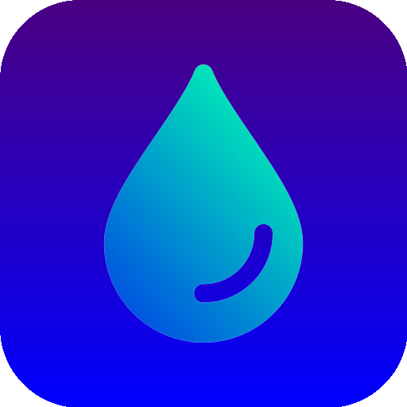
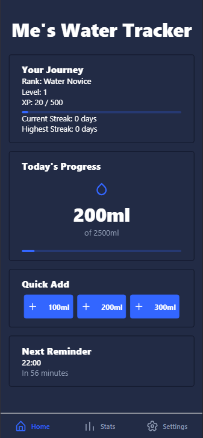

# WaterApp - A Simple Water Intake Tracker



## Overview

WaterApp is a mobile application built with React Native and Expo, designed to encourage consistent hydration through a simple and intuitive interface. Inspired by my girlfriend’s low water intake, I created this app to help her—and others—track their daily water consumption effortlessly. To make it engaging, I added a gamification layer with ranks and levels, turning hydration into a fun challenge.

## Features

- **Water Tracking**: Log water intake with quick-add buttons (100ml, 200ml, 300ml).
- **Daily Goal**: Set and track a personalized daily water goal based on weight and activity level.
- **Gamification**: Earn experience points (XP) and level up with ranks like "Water Novice" to "Aqua Legend".
- **Notifications**: Schedule reminders to stay hydrated throughout the day.
- **Stats Overview**: View monthly progress with a calendar heatmap and detailed statistics.
- **Settings**: Customize goals, reminders, and toggle between light/dark themes.
- **Onboarding**: Simple setup process to personalize the experience.

## Screenshots



## Tech Stack

- **Framework**: React Native with Expo
- **UI Library**: `@ui-kitten/components` for a polished, customizable design
- **State Management**: React Hooks (`useState`, `useEffect`)
- **Storage**: AsyncStorage for persisting user data and settings
- **Notifications**: Expo Notifications for scheduling reminders
- **Routing**: Expo Router for navigation
- **Styling**: StyleSheet with dynamic theming support

## Project Structure

- **`_layout.tsx`**: Root layout with theme management and navigation stack.
- **`index.tsx`**: Entry point with onboarding check and redirect logic.
- **`HomeScreen.tsx`**: Main screen for tracking water, viewing progress, and gamification.
- **`OnboardingScreen.tsx`**: Setup flow for new users.
- **`SettingsScreen.tsx`**: Configuration for goals, notifications, and profile.
- **`StatsScreen.tsx`**: Monthly stats with a custom calendar view.
- **`TabLayout.tsx`**: Bottom tab navigation for Home, Stats, and Settings.
- **`NotFoundScreen.tsx`**: Fallback UI for invalid routes.

## Why I Built This

I noticed my girlfriend wasn’t drinking enough water daily, which inspired me to create a tool to make hydration simple and fun. By adding gamification elements like ranks and streaks, I aimed to motivate her to stay consistent. This project blends utility with a playful twist, reflecting my ability to design user-centric apps while experimenting with engaging features.

## Installation

1. Clone the repository:
   ```bash
   git clone https://github.com/chirraaa/waterapp.git
   ```
2. Install dependencies:
   ```bash
   cd waterapp
   npm install
   ```
3. Start the app:
   ```bash
   npx expo start
   ```
4. Use the Expo Go app to scan the QR code or run on a simulator.

## Future Enhancements

- Add hydration streak notifications to boost motivation.
- Integrate a chart library for more detailed intake trends.
- Support multiple users or profiles for shared devices.
- Include a widget for quick water logging from the home screen.

## What I Learned

- Implementing responsive UI with React Native and `@ui-kitten`.
- Managing local persistence with AsyncStorage.
- Scheduling and handling notifications with Expo.
- Balancing functionality with a clean, user-friendly design.
- Adding gamification to enhance user engagement.
